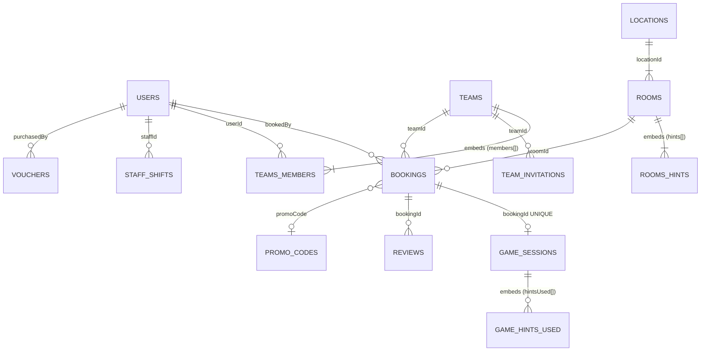

# MongoDB duomenų modelis

Validatoriai ir indeksai kode: `backend/app/init_db.py`.

```mermaid
erDiagram
  USERS ||--o{ BOOKINGS : "bookedBy"
  TEAMS ||--|{ TEAMS_MEMBERS : "embeds (members[])"
  USERS ||--o{ TEAMS_MEMBERS : "userId"
  TEAMS ||--o{ TEAM_INVITATIONS : "teamId"
  LOCATIONS ||--|{ ROOMS : "locationId"
  ROOMS ||--|{ ROOMS_HINTS : "embeds (hints[])"
  ROOMS ||--o{ BOOKINGS : "roomId"
  TEAMS ||--o{ BOOKINGS : "teamId"
  BOOKINGS ||--o| GAME_SESSIONS : "bookingId UNIQUE"
  GAME_SESSIONS ||--o{ GAME_HINTS_USED : "embeds (hintsUsed[])"
  BOOKINGS ||--o{ REVIEWS : "bookingId"
  USERS ||--o{ STAFF_SHIFTS : "staffId"
  USERS ||--o{ VOUCHERS : "purchasedBy"
  BOOKINGS }o--o| PROMO_CODES : "promoCode"
```

TODO: įkelti pilną diagramą su laukais ir pagrindimą (embed vs reference, indeksai, vientisumas).
